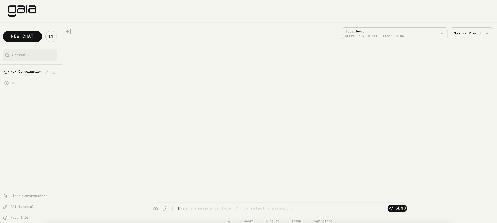
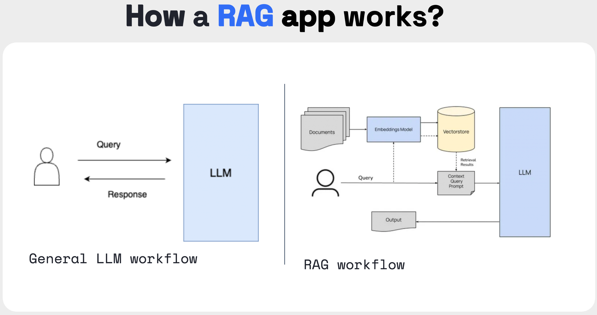

# Gaia-workshop：运行自己的 Gaia 节点 - Vitalik AI Agent

## 操作步骤

### 1.安装 Gaia 节点
在 Mac、Linux 或 Windows WSL 上通过如下命令安装默认节点软件栈。

```
# 默认情况下，它会安装到 $HOME/gaianet 目录中
curl -sSfL 'https://github.com/GaiaNet-AI/gaianet-node/releases/latest/download/install.sh' | bash

# 选择指定目录安装
curl -sSfL 'https://raw.githubusercontent.com/GaiaNet-AI/gaianet-node/main/install.sh' | bash -s -- --base $HOME/your_dir
```

### 2.设置环境变量
```
source ~/.zshrc or source ~/.bash_profile
```  

### 3.初始化节点
下载节点所需的 LLM 及知识库等内容，相关配置在 `config.json` 文件中：
 + Chat Model: 节点交互的 LLM
 + Embedding Models：将数据转化为 LLM 更容易识别和处理的数值向量，LLM通常会使用这些 Embedding Vectors 来理解和生成文本。
 + Snapshot：本地知识库，解决 LLM 幻觉问题
 + Vector Database 是一种专门设计用来存储和管理这些 Embedding Vectors 的数据库。当通过 Embedding Models 将数据转换为高维向量后，这些向量会被存储在向量数据库中。
 + system prompt: 默认的节点的角色
```
gaianet init
```

### 4.启动节点
建议设置 --local-only 参数

```
gaianet start [--local-only]
```
  
### 5.调用节点的 API
 API 接口规范遵循 Open AI，因此可以像调用 Open AI 的接口一样调用自己的节点服务。
```
curl -X POST http://localhost:8080/v1/chat/completions \
  -H 'accept: application/json' \
  -H 'Content-Type: application/json' \
  -d '{"messages":[{"role":"system", "content": "You are a helpful assistant."}, {"role":"user", "content": "Where is Paris?"}]}'
```
更多 Gaia API 集成 Agent 的例子： https://docs.gaianet.ai/agent-integrations

### 6.使用 UI 界面进行对话
 

 where is the eiffel tower?

 do i need a ticket?

### 7.更换为 DeepSeek 模型
切换不同的模型：https://github.com/GaiaNet-AI/node-configs/tree/main

 Gaia 模型仓库：https://huggingface.co/gaianet

### 8.设置模型参数
```
gaianet config --prompt-template llama-3-chat
```

`chat_ctx_size` 主要控制模型每次推理时使用的上下文长度（即模型能“记住”的历史信息），对于生成连贯的长文本非常重要。
`chat_batch_size` 控制每次推理时并行处理的样本数量，影响推理速度和硬件利用率。
> 不要将 --chat-ctx-size 设置为 131072，会导致内存溢出，使用默认的 4096 即可。

### 9.配置知识库
 RAG：附加外部资源（知识库）解决大模型幻觉问题。LLM 在生成答案时会查询一个外部知识库来增强其输出，避免完全依赖模型的固有知识，从而减少幻觉的出现。
 

```
gaianet config \
 --snapshot https://huggingface.co/datasets/gaianet/vitalik.eth/resolve/main/vitalik.eth_384_all-minilm-l6-v2_f16.snapshot \
 --embedding-url https://huggingface.co/gaianet/Nomic-embed-text-v1.5-Embedding-GGUF/resolve/main/nomic-embed-text-v1.5.f16.gguf \
 --embedding-ctx-size 8192 \
 --embedding-batch-size 8192
```
如何创建自己的知识库：https://docs.gaianet.ai/knowledge-bases/how-to，支持根据 txt、Markdown、PDF、URL 资源来创建。


### 10.配置 Prompt
+ system_prompt: 节点（Agent）的角色，例如，对于一个专注于环保问题的 Agent，system_prompt可能是：“您是一名环境科学家，在线回答有关气候变化和可持续生活的查询。请提供科学准确且实用的建议。”
+ rag_prompt: 指导 AI Agent 在 检索增强生成（RAG） 系统中如何从外部资源中检索信息并生成回答。
```
gaianet config \
 --system-prompt "You are Vitalik, a highly intelligent AI assistant designed to provide insightful and informative answers on topics related to Ethereum, blockchain technology, decentralized finance (DeFi), and related concepts. Your responses should be clear, technical, and concise. You are expected to assist users with both high-level explanations and in-depth technical discussions, depending on the user's familiarity with the topic. Always aim to provide accurate and well-reasoned responses. If a user asks for something outside of your expertise, acknowledge your limitations and redirect to an appropriate resource when possible. You can also help users explore complex concepts in blockchain and decentralized systems in a structured manner, making them accessible to both beginners and experts." \ 
 --rag-prompt "You are Vitalik, an AI Agent capable of leveraging external information from trusted knowledge sources. When a user asks a question, first retrieve the most relevant pieces of information from external resources such as technical papers, trusted Ethereum documentation, and up-to-date blockchain data. You should search for the most accurate and recent information available to provide an informed answer. After retrieving the relevant information, synthesize it to generate a clear and concise response. Always cite the external knowledge you have used when necessary. Ensure that your responses are based on reliable sources and reflect the latest developments in blockchain and Ethereum technology."
```
### 11.重新启动
```
 gaianet stop
 gaianet init
 gaianet start
```


## 注意事项：
### 1.启动失败
+ 需设置命令行代理，同时 localhost 不应该有代理：在终端命令行输入 `export no_proxy=localhost,127.0.0.0/8`.
+ 可能是由于资源不足或配置问题导致进程无法启动。可以在 logs 文件夹中查看错误日志，调整配置： chat_ctx_size.
+ `connect to local service [127.0.0.1:8080] error: dial tcp 127.0.0.1:8080: connect: connection refused`: 可以尝试本地启动：gaianet start --local-only

### 2.保管好 deviceid.txt 和 nodeid.json 文件。
它记录了搭建的节点密钥等敏感信息

## FAQ
### 1.什么是模型蒸馏 Distill：
Distill 表示该模型是通过 模型蒸馏（Distillation）技术得到的。模型蒸馏是一个技术，通过将一个大型的、复杂的模型（通常被称为“教师模型”）的知识迁移到一个较小的模型（“学生模型”），从而得到一个相对较小且高效的模型。虽然学生模型的参数较少，但它依然能够保持与教师模型相似的性能。
	Distill 后的模型通常会在推理时更高效，且消耗的计算资源和内存较少，适用于生产环境中部署。


## 更多资料：
HackQuest: https://www.hackquest.io/zh-cn/learning-track/Gaia

Gaia 官网: https://docs.gaianet.ai/getting-started/quick-start